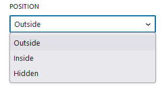

We can select various properties of the close button icon. It has settings for 
the close button's position, size, color, and close icon styles.

The close button option include the following features:

<ul>
    <li>position</li>
    <li>Size</li>
    <li>Color</li>
    <li>Close Icon Styles</li>
</ul>
##Position

Select a position whether the icon should display Inside the module, Outside it, or be Hidden. The position is outside on default.

<ul>
    <li>Outside
        
Select Outside if you want to place your close icon outdide the popup area. The position is currently set to the top right off the popup.

    </li>
    <li>Inside
        
Select Inside if you want to place your close icon inside the popup area. The position is currently set to the top right off the popup.

    </li>
    <li>Hidden
        
You can hide the close button icon by choosing this option. Also, this will remove other menu choices like size and color.

    </li>
</ul>

##Size

Input Close icon size in terms of pixels . The default size is 20px.

##Color

Use the Color Palette to choose color schemes, or insert color code if you wish to use your own custom color.

##Close Icon Style

Select three different icon style available in our popup. Default, Circular and Rectangular.
