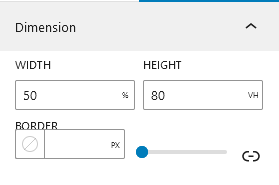
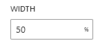
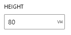
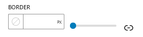
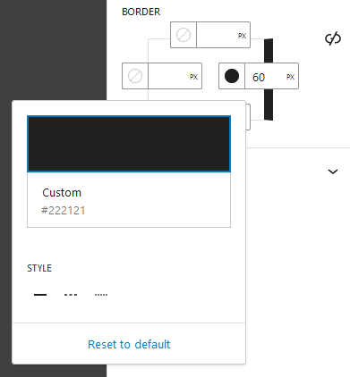

You have the flexibility to adjust the Popup's dimensions (how tall and wide it is) and its border (the outline or frame around it) to match your personal preferences. This means you can make the Popup as big or small as you like, and you can choose whether it has a border or not, all based on what you prefer or what suits your design.

##Width

 You can set overall width of the Popup. The default value of the width is 50%. Also, various width units like em, rem, px, % etc. can be specified appropriately.

##Height

 You can set the Height of Popup. The default height of popup is 80vh.  Also, various height units like vh, px, % etc. can be specified appropriately.

    For a better design purpose, the maximum height of the popup
    is set to 80% of the overall display. So height of the Popup 
    can't exceed more than 80% from the option itself.
    If you really need to set it more than it, then you would have
    to set it using custom CSS.

##Border

Border Options allows you to set the popup's borders. The border can be expanded in four extra directions.
Top, bottom, left, and right. Individual border width and color can be selected.  The units used to specify
border width include px, %, em, rem, etc.

You can make any side of border bigger starting from the rightmost icon in the picture above. After expanding the border,
you can choose which direction you want it to go. However, even after doing this, the border still won't function 
correctly. To make it work, you must select the stroke style from the bottom of the color palette.