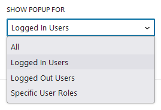
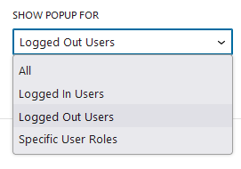
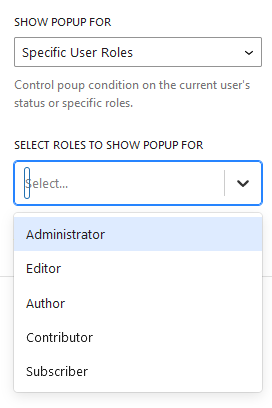

You may want to show the Popup only to your specific user groups since it may not be relevant to your other group of 
users. For example, you want to show a specific popup only for your logged-in user and not the logged-out users or want to
show specific offers to your subscribers only but not to the shop-owner.

In such conditions, the block provides you option to configure the conditions as specified below.

## All
By default, the pop-up appears for all the users or roles.

## Logged-In Users

Shows popup to only the logged-in users.

  

## Logged-Out Users

Shows popup to only the logged-out users.

 
   
## Specific User Roles

Show the popup only to users who have at least one of the selected roles. use WordPress's default user roles

    For example: administrator, editor and so on.
   
    
           
  