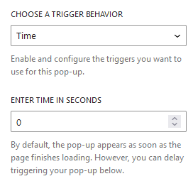
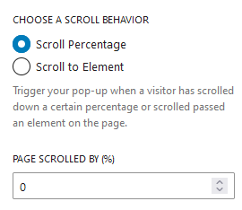
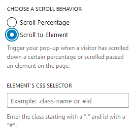
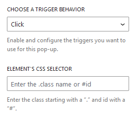

The timing for when a Popup shows up on a webpage can be significant. It's a matter of preference. Some might want the popup to greet visitors as soon as they arrive, catching their attention before they even look at or engage with the page's content. On different occasions, you might prefer to give visitors some time to explore the page's content before the popup makes its entrance. Or, perhaps, you'd like the popup to only appear when users actively click on something.

You have the option to choose one of the triggers available and set it up according to your preference as outlined below.
## Time

By default, the pop-up appears as soon as the page finishes loading. However, you can delay triggering the pop-up by setting the time in seconds.

## On Scroll

On page scroll, the popup can be activated by choosing the scroll behavior. The type of page scroll on which the popup appears can be customized.

- <b>Scroll Percentage:</b>
    
    

    
Provides the option to input a percentage, and when the desired scroll percentage is achieved, a popup is displayed.

- <b>Scroll to element:</b>
   
    
    
    
Provides a choice to add elements, such as by class or ids, and displays the popup once that element is reached.

## Click

Allows you to select elements by class or IDs and shows a popup when you click on the element with that class or IDs.