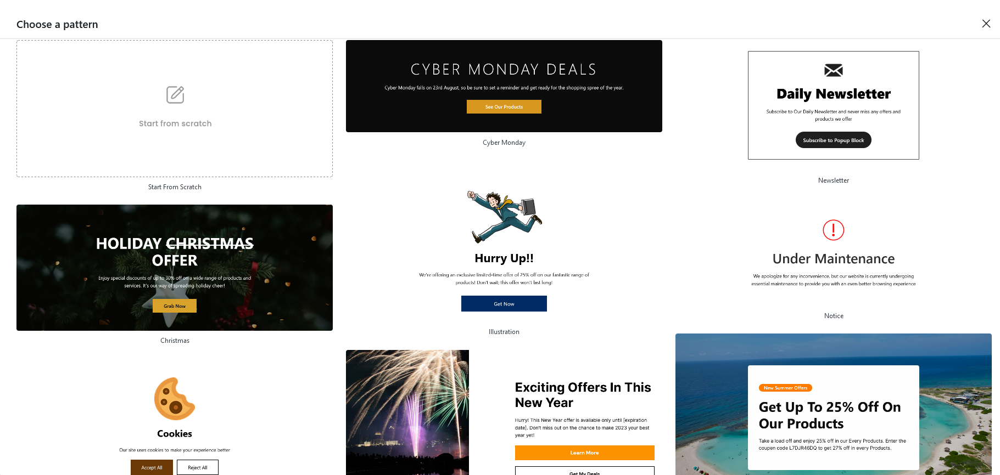

When the block is inserted for the first time, you are provided with a modal to select 
a list of pre-made templates. There's a selection of over 5+ diverse template options
to choose from. 

In essence, you have the freedom to either design your popup from the scratch or use one 
of the ready-made templates, whichever suits your needs and preferences. 

Currently following are the templates included:

- Cyber Monday 
- Christmas
- Newsletter
- Illustration
- Notice
- Cookies
- NewYear
- Vacation

Hover your mouse over any of the available templates and click, the template will be auto inserted for the Popup.
You can also choose the **Start from scratch** option to create a completely unique design.

    Note: Please be aware that there is a maximum height restriction for the popup, 
    capped at 80vh.
